# 🏗️ DIAGRAMAS DE ARQUITETURA - SISTEMA COFFEELIER ERP

Este documento contém diagramas visuais da arquitetura, estrutura e fluxos do sistema.

---

## 📊 1. ARQUITETURA GERAL DO SISTEMA

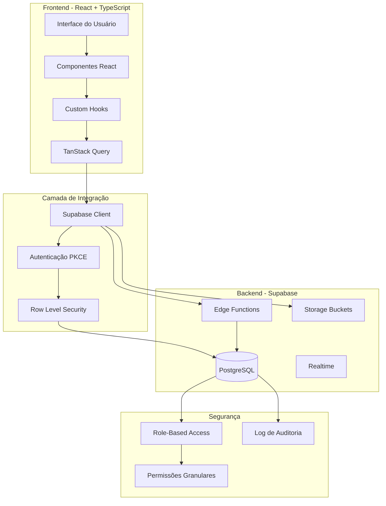

---

## 🗄️ 2. ESTRUTURA DO BANCO DE DADOS (PRINCIPAIS ENTIDADES)

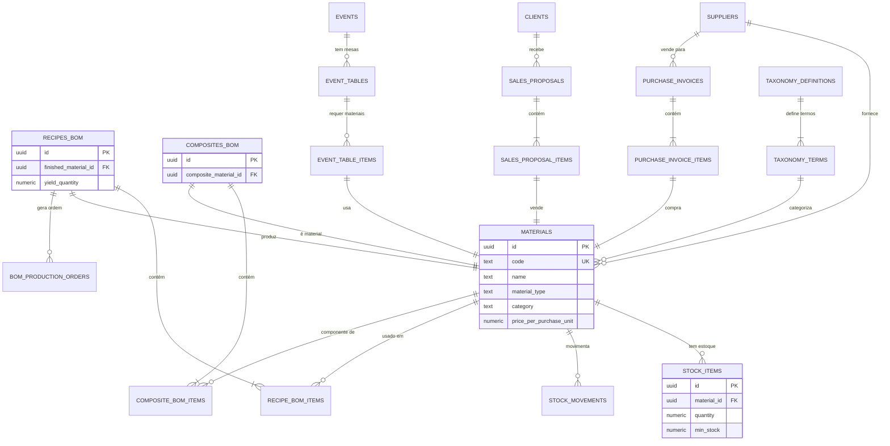

---

## 🔐 3. FLUXO DE AUTENTICAÇÃO E AUTORIZAÇÃO

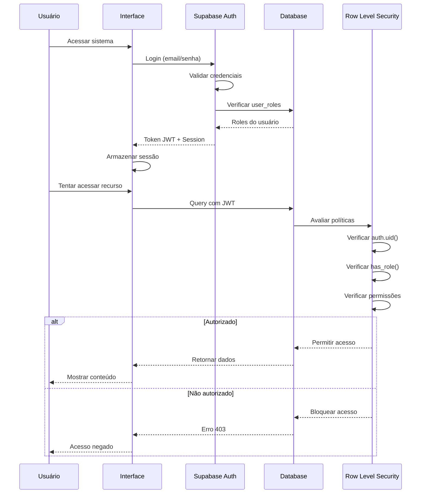

---

## 🏭 4. FLUXO DE PRODUÇÃO (BOM)

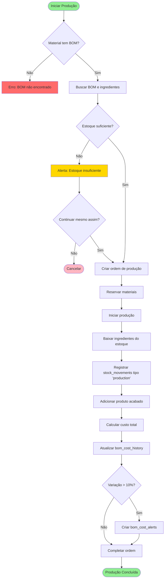

---

## 🛒 5. FLUXO DE COMPRAS

```mermaid
flowchart LR
    subgraph "1. Identificação"
        A1[Estoque abaixo do mínimo] --> B1[Gerar requisição]
        A2[Necessidade de produção] --> B1
        A3[Solicitação manual] --> B1
    end
    
    subgraph "2. Cotação"
        B1 --> C1[Consultar fornecedores]
        C1 --> C2[Comparar preços]
        C2 --> C3[Selecionar fornecedor]
    end
    
    subgraph "3. Pedido"
        C3 --> D1[Criar ordem de compra]
        D1 --> D2[Enviar ao fornecedor]
        D2 --> D3[Aguardar entrega]
    end
    
    subgraph "4. Recebimento"
        D3 --> E1[Receber mercadoria]
        E1 --> E2[Validar quantidade/qualidade]
        E2 --> E3{OK?}
        E3 -->|Não| E4[Registrar devolução]
        E3 -->|Sim| E5[Upload nota fiscal]
    end
    
    subgraph "5. Processamento"
        E5 --> F1[OCR da nota fiscal]
        F1 --> F2[Validar dados]
        F2 --> F3[Criar purchase_invoice]
        F3 --> F4[Criar purchase_invoice_items]
        F4 --> F5[Gerar stock_movements]
        F5 --> F6[Atualizar stock_items]
        F6 --> F7[Calcular preço médio ponderado]
    end
    
    subgraph "6. Financeiro"
        F7 --> G1[Criar contas a pagar]
        G1 --> G2[Agendar pagamento]
        G2 --> G3[Registrar pagamento]
    end
    
    E4 --> H1([Fim])
    G3 --> H2([Concluído])
    
    style B1 fill:#FFE4B5
    style F1 fill:#87CEEB
    style G3 fill:#90EE90
```

---

## 💰 6. FLUXO DE VENDAS E PROPOSTAS

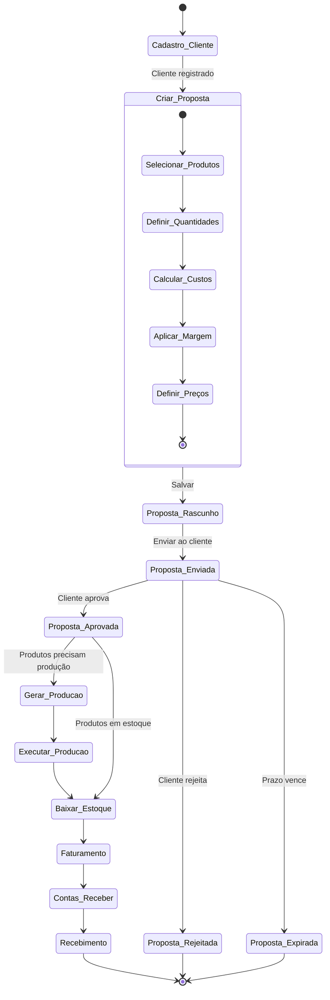

---

## 📅 7. FLUXO DE EVENTOS

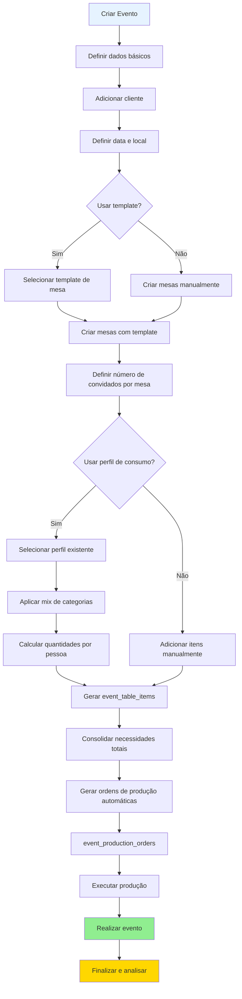

---

## 🧩 8. MÓDULOS E SUAS INTERAÇÕES

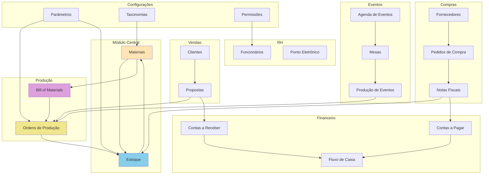

---

## 🔄 9. CICLO DE VIDA DE UM MATERIAL

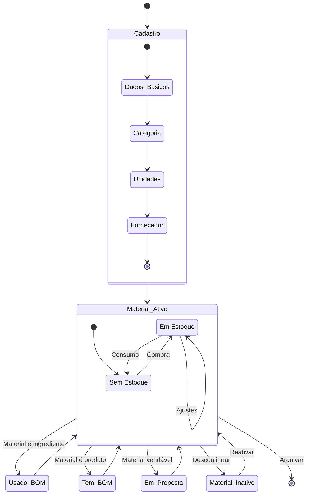

---

## 💾 10. CAMADAS DE DADOS E SEGURANÇA

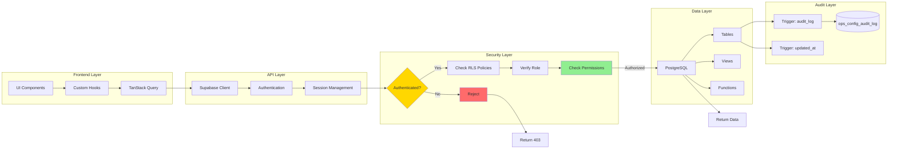

---

## 📈 11. FLUXO DE CÁLCULO DE CUSTOS

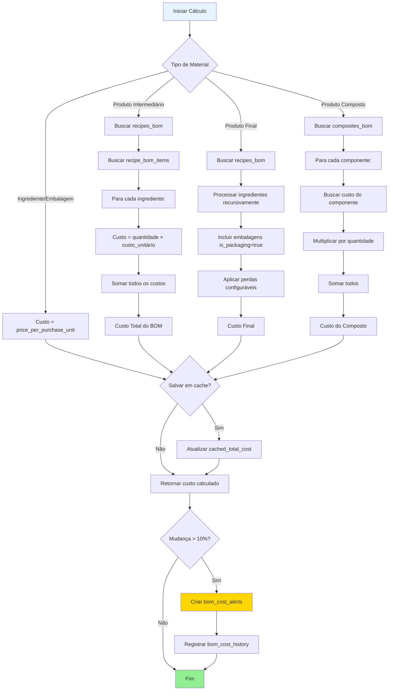

---

## 🔍 12. SISTEMA DE TAXONOMIAS

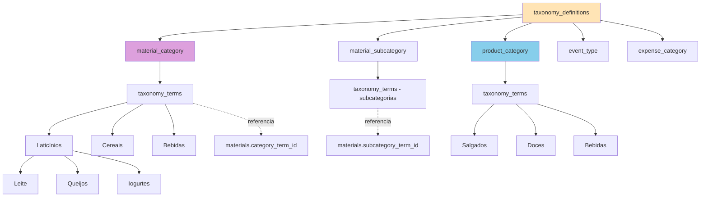

---

## ⚙️ 13. SISTEMA DE CONFIGURAÇÕES

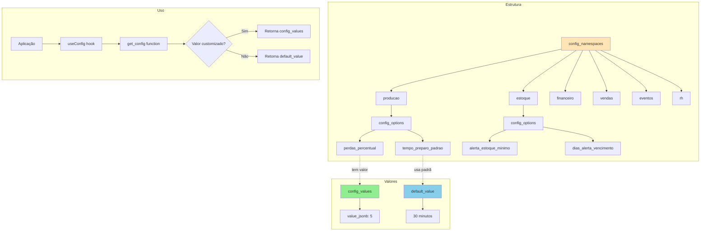

---

## 🎯 CONCLUSÃO

Estes diagramas fornecem uma visão visual completa da arquitetura do Sistema Coffeelier ERP, incluindo:

- ✅ Arquitetura geral em camadas
- ✅ Modelo de dados e relacionamentos
- ✅ Fluxos de autenticação e autorização
- ✅ Processos de negócio (produção, compras, vendas, eventos)
- ✅ Interações entre módulos
- ✅ Ciclo de vida de dados
- ✅ Sistemas de segurança e auditoria
- ✅ Cálculos e configurações

**Para visualizar**: Cole o código Mermaid em ferramentas como:
- GitHub (suporte nativo)
- Mermaid Live Editor (https://mermaid.live)
- VS Code com extensão Mermaid
- Documentação markdown com suporte Mermaid
